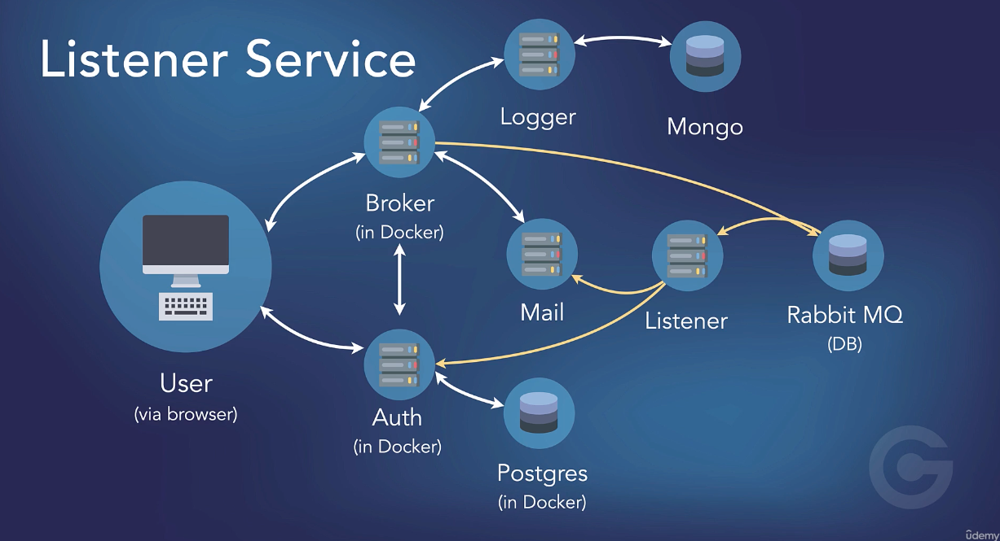

# Go microservice

### Run
``` shell
cd project
make up_build
make start
# access: localhost
```

### Service list
```
- front-end:        localhost:80
- broker-service:   localhost:8080
- auth-service:     localhost:8083
- auth-service:     localhost:8081
- mailer-service:   localhost:8084
- listener-service: internal
- postgres:         port: 5433
- mongo:            port: 27017
- mailhog-web:      port: 8025
- mailhog:          port: 1025
- rabbitMQ:         port:5672
```

### Run front-end locally
``` shell
cd ./fron-end
go run cmd/web/main.go # access http://localhost:80
```

### Run broker service locally
``` shell
cd ./broker-service
go run ./cmd/api # access http://localhost:80
```

### Run project in docker
```
cd project
docker-compose up -d 
# Access http://localhost:8080 # broker service
```

### Makefile
```
# services
up:    make up
build: make up_build
down:  make down
# front-end
build front_end: make build_front
start front_end: make start
stop front_end: make stop
```


### Documentation 


### GRPC 
```
cd logger_service/logs
protoc --go_out=. --go_opt=paths=source_relative --go-grpc_out=. --go-grpc_opt=paths=source_relative logs.proto 
```

### K8s
- #### Setup and push images to [minikube registry](https://minikube.sigs.k8s.io/docs/handbook/registry/#:~:text=minikube%20allows%20users%20to%20configure,requests%20from%20the%20CIDR%20range.)

```shell
minikube addons enable registry

docker run --rm -it --network=host alpine ash -c "apk add socat && socat TCP-LISTEN:5000,reuseaddr,fork TCP:$(minikube ip):5000" # still running
# open a new terminal
kubectl get service --namespace kube-system

# to expose run registry catalog
kubectl port-forward --namespace kube-system service/registry 5000:80 # still open
# open a new terminal
curl http://localhost:5000/v2/_catalog
```

#### Build services images in push to registry

```shell
cd broker-service
docker build . -f ../broker-service/broker-service.dockerfile -t localhost:5000/broker-service
docker push localhost:5000/broker-service
```


#### Deploy in k8s
``` shell
asdf install # https://asdf-vm.com/
brew install minikube
brew link minikube
minikube start --insecure-registry "10.0.0.0/24"
minikube status
kubect get pods
minikube dashboard
cd projects
kubectl apply -f k8s
```

Udemy course: [Working with Microservices in Go (Golang)](https://www.udemy.com/course/working-with-microservices-in-go/)